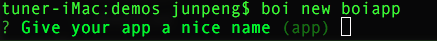
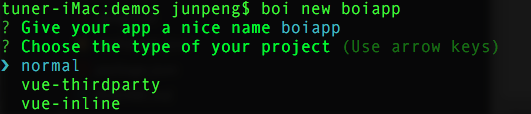
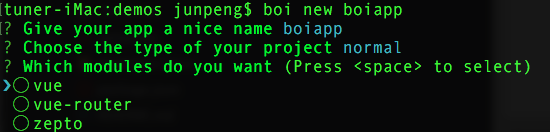
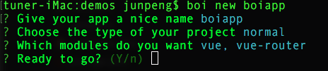
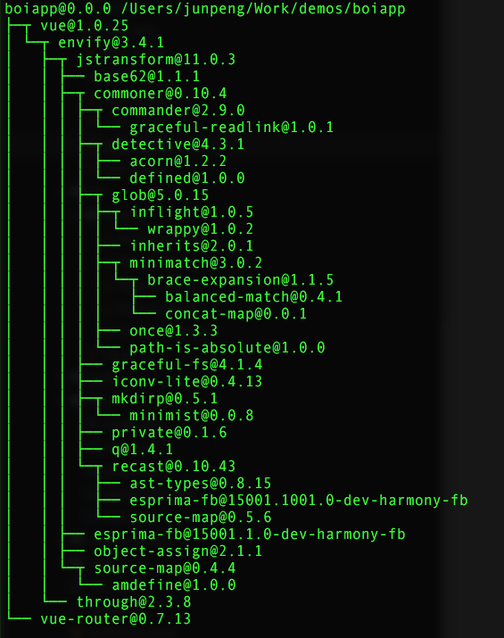
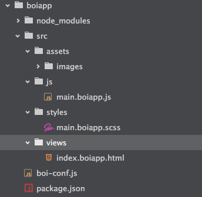

### boi编译兼容
boi的编译功能基于webpack内核实现，默认的编译输出文件只兼容IE8+浏览器。如果需要兼容IE8以下浏览器，可以按照boi的配置API进行单独配置。

### boi脚手架
boi内置三种不同类型的项目脚手架：
* normal： 常规项目。不限制技术选型，用户可根据自身需求选择任意框架和第三方库；
* vue-thirdparty：将vue作为第三方库单独引入。简单说就是vue.js不参与编译，在html文档中使用`script`标签单独引入；
* vue-inline：将vue作为一个模块使用。在项目代码中`require`、`import`或其他模块化方案加载vue，vue参与编译。

> boi内置的三种脚手架是从daojiaFE团队实际需求出发，所以不具有宽泛的通用性。boi提供[自定义脚手架API]()，用户可以根据自身需求进行定制。

#### 使用脚手架搭建项目
使用命令行工具运行：

```
boi new webapp
```

或者在已存在目录下运行：

```
boi new .
```

命令行将依次有以下提示：

* 自定义项目名称，默认项目名称为app：
    

* 选择项目类型：
 
    

* 选择npm第三方依赖：
    

* 最终确认：

    

* 配置完毕后，boi会自动安装npm第三方依赖：
    

    执行成功后，生成的项目目录如下图：

    

#### 编译项目文件
使用脚手架成功搭建项目之后，进入项目目录：
```
cd webapp
```

在项目根目录下执行`build`命令：
```
// 默认dev环境编译，编译输出source map文件，并且代码不压缩
boi build
```

或者
```
// 生成环境编译，无source map文件，代码压缩
boi build prod
```

默认编译输出的目录`dest`。


#### dev server  
boi提供dev server以方便本地开发调试，在项目根目录下执行：

```
boi serve
```
默认监听`8888`端口。

执行成功后，如果项目中只存在一个`index.*.html`文件，直接访问`localhost:8888`即可；如果项目中存在多个`index.*.html`文件，访问`localhost:8888/*.html`或者`localhost:8888/views/*.html`(html文件根据具体命名改动)。

boi支持动态编译，开发过程中已存文件的修改不必重启dev server。但如果增加新文件，则必须重启dev server才可看到效果。
