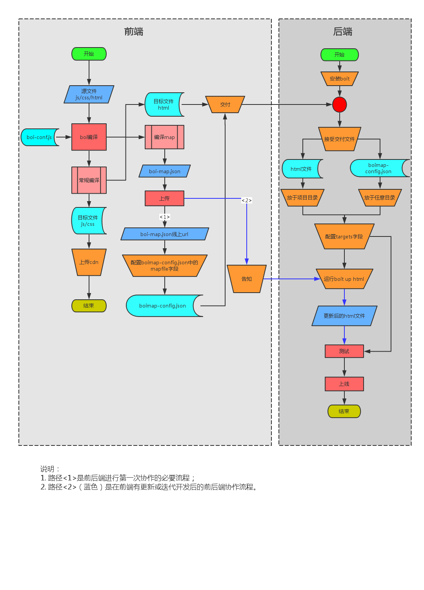
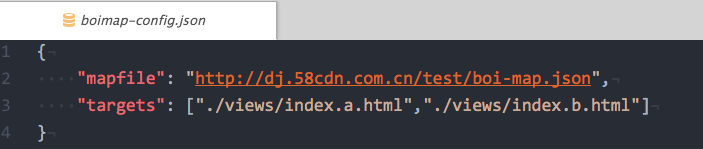

### 前后端分离解决方案boit

[boit](https://github.com/boijs/boit)是58到家FE团队根据目前团队情况，研究出的一种折中的前后端分离开发方案。主要目标是解耦前后端协作开发中难以解耦的html模板层。

#### 传统的前后端协作模式
前后端协作开发最原始的状态：FE切图+写demo，RD写js逻辑+套模板。这种场景下FE通常自嘲为“切图仔”。FE和RD在这种协作模式下都非常痛苦：
1. FE写好的css+html交付给RD另加工；
2. RD套模板过程中很大概率会手误写错了某个标签或者classname；
3. RD编写js脚本，如果遇到频繁操作DOM的需求，需要不断与FE同事沟通；
4. 静态资源的部署也由RD负责，增加了RD的工作负担；
5. 上线后如果发生css问题，需要重复以上过程。

这种效率极其低下的模式，不得不承认是由FE编程能力不足导致的。

> 很不幸，目前仍然有很大一部分团队使用这种模式。

要改善以上模式的低效率问题，首先，把编写js的工作交由FE负责是第一步；其次，静态资源应该由FE负责部署；最后，html模板层也应该交由FE负责。但是，html模板通常与后端的controller代码一同部署，与静态资源的部署是分离的。此外，FE同学在不熟悉模板语言和模板local数据结构的情况下，html模板层仍然不能完全交给FE负责。以58到家目前的前后端协作模式，大概步骤如下：

1. FE编写js、css和初始html模板；
2. FE上传js、css文件到cdn，通过前端框架boi将html中js、css的地址编译成cdn url；
3. FE将html文件交付给RD，RD再进行额外的加工，比如写入页面初始数据；
4. 如果js、css文件有更新，FE需要进行编译，编译后的html再次交付给RD；
5. RD接受更新后的html文件，复制+粘贴，如果有jsp代码，还需要额外的复制+粘贴。

这种模式相比原始的模式虽然效率有所提升，但仍然需要大量的人工重复性工作。

#### boit

boit的工作就是减轻重复性工作，自动化更新html模板中静态资源的url；

整体流程如下图所示：

基本流程如下：

1. FE负责开发js、css、html源文件，使用boi编译输出一份静态资源（js、css）文件名与cdn url的map文件`manifest.json`；
2. FE将`manifest.json`文件上传后得到此文件的线上url，然后配置另一个json文件`boimap-config.json`中的`mapfile`字段，如下：

3. FE将html文件和`boimap-config.json`文件交付给RD，RD同学将html文件放入项目目录后，配置`boimap-config.json`的`targets`字段，这个字段是html文件在项目目录的path地址（绝对路径和相对路径都可以）；
4. RD同学对html另加工，比如写入jsp页面初始数据；
5. RD同学安装node.js环境，然后安装boit：`nom install boit -g`；
6. 当FE的js、css文件有更新后，使用boi编译输出`manifest.json`文件并上传到此文件现有的cdn覆盖，随后告知RD同学；
7. RD同学接到FE的更新通知后，在本机`boimap-config.json`所在的目录运行`boit up html`，运行成功后，html文件中对js、css的引用地址便会更新为最新的url，其他代码不会受任何影响。

利用boit可以减少RD同学大量的重复性复制+粘贴，这种模式下，FE同学需要做的是开发+更新+上传+配置mapfile；RD同学需要做的是安装nodejs+安装boit+配置targets+运行boit。

> boit只是一种探索性的折中方案。
